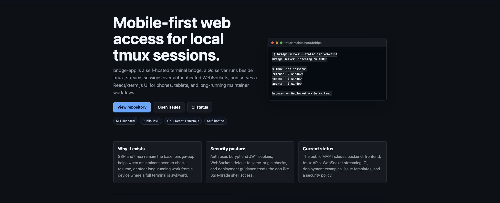

# bridge-app

[](https://github.com/ivanxgb/bridge-app/actions/workflows/ci.yml)
[](./LICENSE)
[](https://ivanxgb.github.io/bridge-app/)

[](https://ivanxgb.github.io/bridge-app/)

Mobile-first web access for local `tmux` sessions.

`bridge-app` is a self-hosted terminal bridge: a Go server talks to `tmux`,
streams panes over WebSockets, and serves a React UI optimized for phones,
tablets, and long-running developer sessions.

It is built for people who keep work alive inside `tmux` and want to check,
resume, or steer those sessions from another device without opening SSH in a
mobile terminal.

## Why Not Just SSH Into tmux?

SSH plus `tmux` is still the foundation. bridge-app is for the awkward moments
around it: checking a build from a phone, resuming an agent session from a
tablet, sharing a private dashboard with a trusted device, or monitoring several
long-running panes without fighting a mobile terminal emulator.

The project keeps `tmux` as the source of truth and adds a browser layer for the
workflows where a full SSH client is inconvenient.

## Highlights

- Browse live `tmux` sessions, windows, and panes from a responsive web UI.
- Stream terminal output through xterm.js over authenticated WebSockets.
- Create, kill, and inspect sessions from the dashboard.
- Touch-friendly mobile toolbar for common terminal keys.
- Go backend with SQLite users, bcrypt password hashing, JWT auth, and chi routes.
- React + TanStack frontend with Vite, xterm.js, and a dark operations-focused UI.
- Single binary mode: build the web UI and serve it from the Go server.
- Optional CLI chat adapters for Codex/CommandCode-style local agent sessions.

## Status

This is an active MVP. Core backend, auth, `tmux` integration, session dashboard,
terminal streaming, mobile layout, and production packaging are implemented.

Still worth hardening before serious multi-user production:

- rate limiting
- command/session audit log
- stronger admin controls
- broader automated end-to-end coverage around real terminal resize/input

See [docs/roadmap.md](./docs/roadmap.md) for the phase-by-phase implementation
status.

## Architecture

```text
browser
  |
  | React + xterm.js
  | REST + WebSocket
  v
Go HTTP server
  |
  | auth, routing, SQLite
  v
tmux CLI / tmux control mode
  |
  v
local terminal sessions
```

The backend does not require a cloud service. It runs next to the `tmux`
sessions it exposes.

## Quick Start

Requirements:

- Go 1.26+
- Node.js and npm
- `tmux`

```bash
git clone https://github.com/ivanxgb/bridge-app.git
cd bridge-app

# install frontend dependencies
cd web && npm install && cd ..

# build backend and frontend
make build

# generate a signing secret for local development
export BRIDGE_JWT_SECRET="$(openssl rand -hex 32)"

# create the first user
make seed

# run the server and serve web/dist
make run
```

Open `http://localhost:8080`.

For development with Vite:

```bash
export BRIDGE_JWT_SECRET="$(openssl rand -hex 32)"
make dev
```

Backend runs on `http://localhost:8080`; frontend runs on
`http://localhost:5173`.

## Configuration

The server accepts CLI flags:

```bash
./bin/bridge-server \
  --port 8080 \
  --db bridge.db \
  --jwt-secret "$BRIDGE_JWT_SECRET" \
  --static-dir web/dist
```

Important values:

| Value | Purpose |
| --- | --- |
| `BRIDGE_JWT_SECRET` / `--jwt-secret` | JWT signing secret. Required. Use a random value. |
| `BRIDGE_ALLOWED_ORIGINS` / `--allowed-origins` | Optional comma-separated WebSocket origin allowlist. Defaults to same-origin. Use `http://localhost:5173` for Vite dev. |
| `BRIDGE_DB` / `--db` | SQLite database path. Defaults to `bridge.db`. |
| `BRIDGE_STATIC_DIR` / `--static-dir` | Optional built frontend directory. Leave blank for API-only mode. |
| `BRIDGE_PORT` / `--port` | HTTP port. Defaults to `8080`. |

## Documentation

- [Project page](https://ivanxgb.github.io/bridge-app/)
- [Implementation plan](./docs/plan.md)
- [Roadmap and status](./docs/roadmap.md)
- [Vision](./docs/vision.md)
- [Design system](./docs/design-system.md)
- [Integration audit](./docs/integration-audit.md)

The generated HTML versions in `docs/` are published with GitHub Pages.

## Security Notes

This project exposes shell access through a browser, so treat deployment like
you would treat SSH:

- run it only behind HTTPS
- use a long random `BRIDGE_JWT_SECRET`
- set `BRIDGE_ALLOWED_ORIGINS` when serving the UI and API from different origins
- keep the database private
- avoid exposing it to the public internet without rate limiting and monitoring
- prefer a private network, VPN, or trusted reverse proxy for real deployments

The bundled nginx/systemd/Caddy files are examples. Update domains, paths, users,
and secrets before using them.

## Development

```bash
# backend only
go run ./cmd/bridge-server --jwt-secret "$BRIDGE_JWT_SECRET"

# frontend only
cd web && npm run dev

# full build
make build
```

## Contributing

Issues and pull requests are welcome. Good first areas include docs, focused
tests, mobile terminal ergonomics, deployment hardening, and security review.

See [CONTRIBUTING.md](./CONTRIBUTING.md) and [SECURITY.md](./SECURITY.md).

## Project Health

- Current release line: see [CHANGELOG.md](./CHANGELOG.md).
- Planned hardening: rate limiting, audit logs, stronger admin controls, and
  broader end-to-end coverage.
- Public issue templates are available for bugs, features, and security
  hardening tasks.

## License

MIT. See [LICENSE](./LICENSE).
